## What is Django ?

[Django](https://www.djangoproject.com/ "Django official site") is a high-level Python Web framework that encourages rapid development and clean, pragmatic design. Built by experienced developers, it takes care of much of the hassle of Web development, so you can focus on writing your app without needing to reinvent the wheel. It’s free and open source.

---

## Installation

### Python

[Python](https://www.python.org/ "Python official site") is a high-level, interpreted, interactive and object-oriented scripting language. Python is designed to be highly readable. It uses English keywords frequently where as other languages use punctuation, and it has fewer syntactical constructions than other languages.

You can download and install python for [Linux/UNIX](https://www.python.org/downloads/source/ "Download python for Linux/UNIX").

Or, you can install python from terminal

```bash
sudo apt update
```

```bash
sudo apt install software-properties-common
```

```bash
sudo add-apt-repository ppa:deadsnakes/ppa
```

```bash
sudo apt update
```

```bash
sudo apt install python3.8
```

##### Verify install

```bash
python3 --version
```

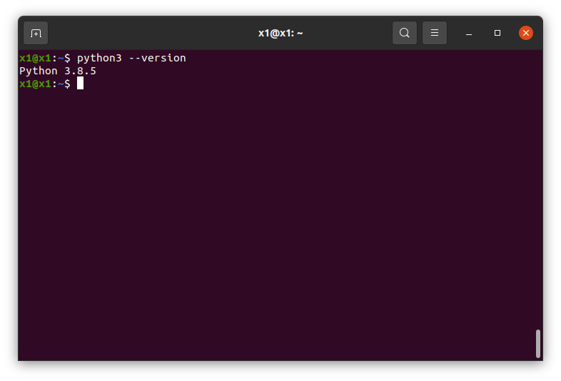

---

### Pip

[pip](https://pypi.org/project/pip/ "pip") is the package installer for Python. You can use pip to install packages from the Python Package Index and other indexes.

```bash
sudo apt-get update
```

```bash
sudo apt-get install python3-pip
```

##### Verify install

```bash
pip3 --version
```

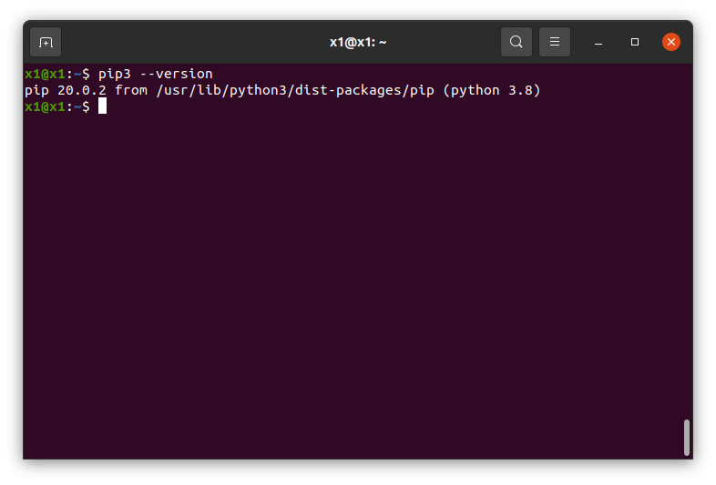

---

### Virtual Environment

[Virtualenv](https://virtualenv.pypa.io/en/latest/#:~:text=virtualenv%20is%20a%20tool%20to,library%20under%20the%20venv%20module. "virtualenv") is a tool to create isolated Python environments.

```bash
sudo apt install python3-virtualenv
```

##### Verify install

```bash
virtualenv --version
```

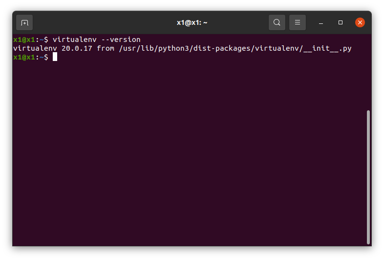

---

## Virtual Environment Setup

```bash
mkdir django_setup
cd django_setup
python3 -m venv env
```

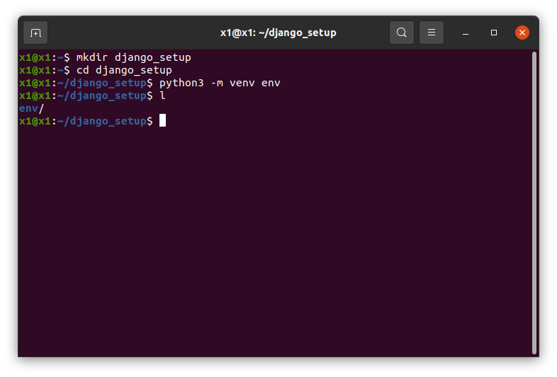

---

### Activating virtual environment

```bash
source env/bin/activate
```

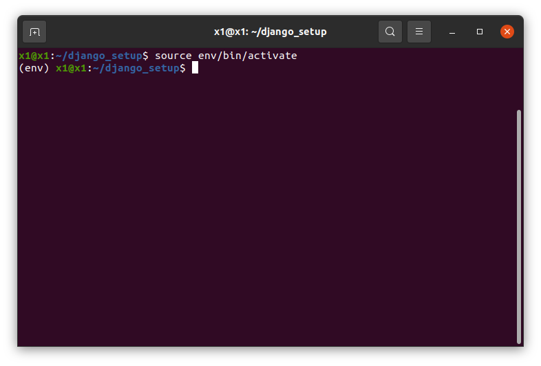

### Deactivating virtual environment

```bash
deactivate
```

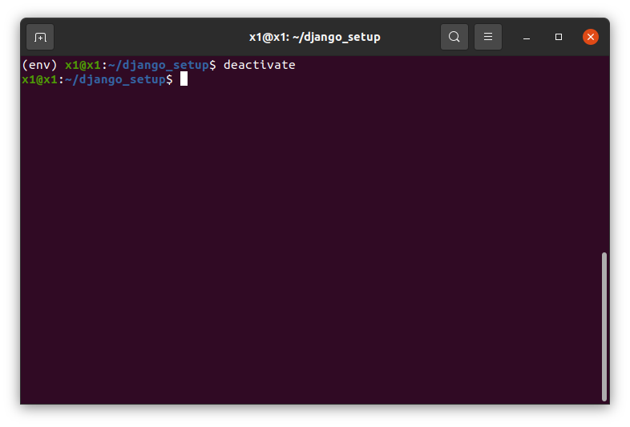

---

### Django installation

**Note :- Before procedding to installation, activate your virtual envirnment (env), otherwise Django will be installed on your system (not in virtual environment), which can cause errors for future projects**

```bash
pip install django
```

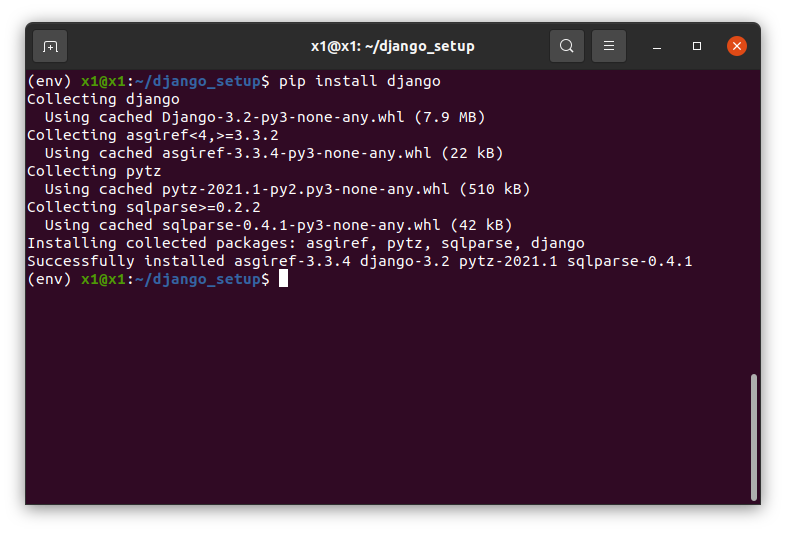

##### Verify installation

```bash
django-admin --version
```

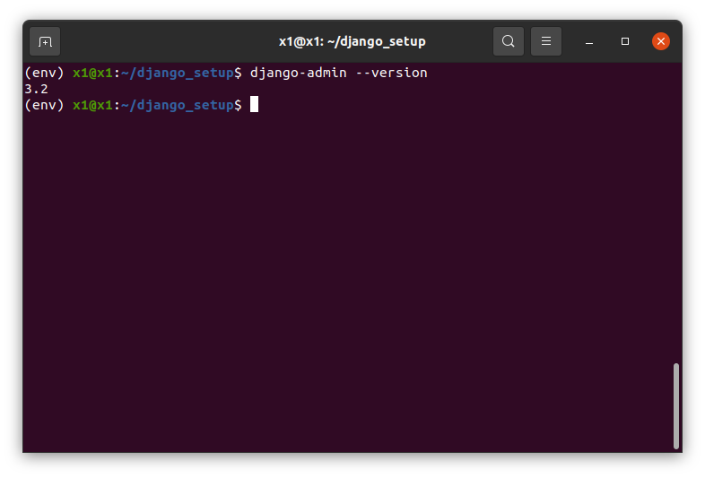

---

### Project Setup

<br/>

#### Create a django project

```bash
django-admin startproject hello_world
```

```bash
cd hello_world
```

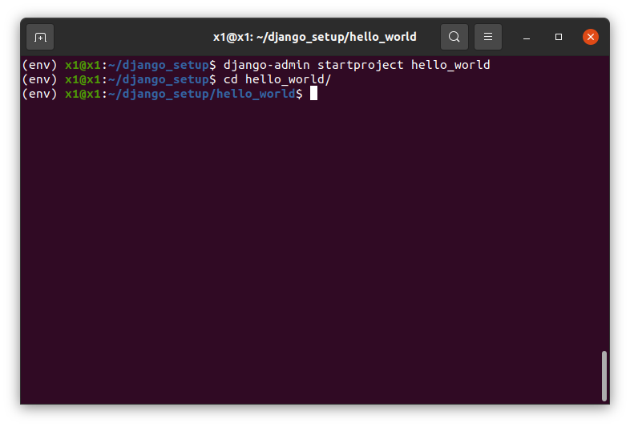

This command will create a hello_world folder (i.e. a django project) with basic django folder structure.

#### Project folder structure

```bash
tree .
```

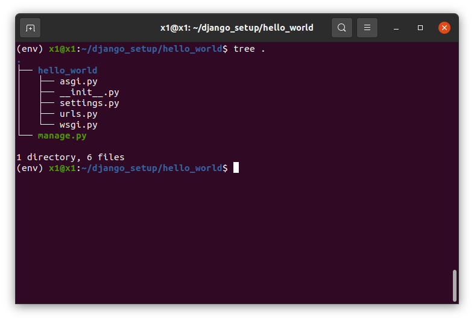

---

### Running localhost

**You will see a warning about unapplied migrations for the first time runserver command. So, we have to migrate all migrations before first time runserver command.**

```bash
python manage.py migrate
```

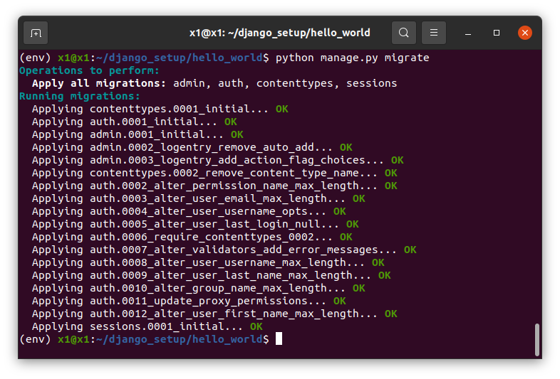

```bash
python manage.py runserver
```

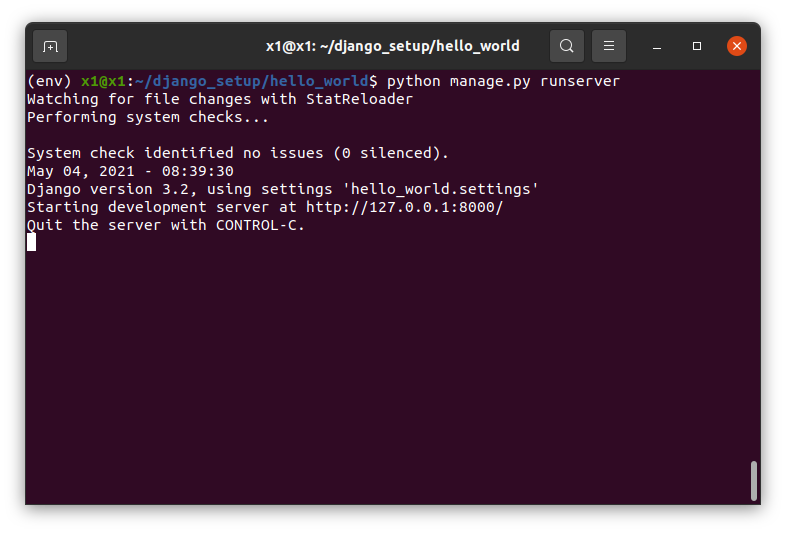

---

### First look of project

This is the default homepage provided by Django.

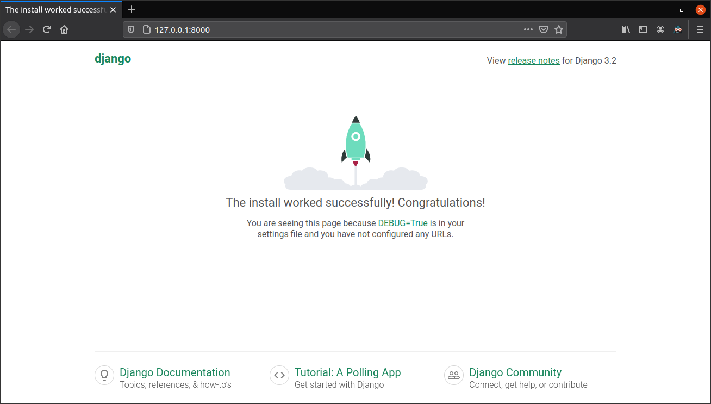

---
