## What is Django ?

[Django](https://www.djangoproject.com/ "Django official site") is a high-level Python Web framework that encourages rapid development and clean, pragmatic design. Built by experienced developers, it takes care of much of the hassle of Web development, so you can focus on writing your app without needing to reinvent the wheel. It’s free and open source.

## Installation

### Python

[Python](https://www.python.org/ "Python official site") is a high-level, interpreted, interactive and object-oriented scripting language. Python is designed to be highly readable. It uses English keywords frequently where as other languages use punctuation, and it has fewer syntactical constructions than other languages.

Check wether python is installed on you windows by running command

```bash
python -V
```

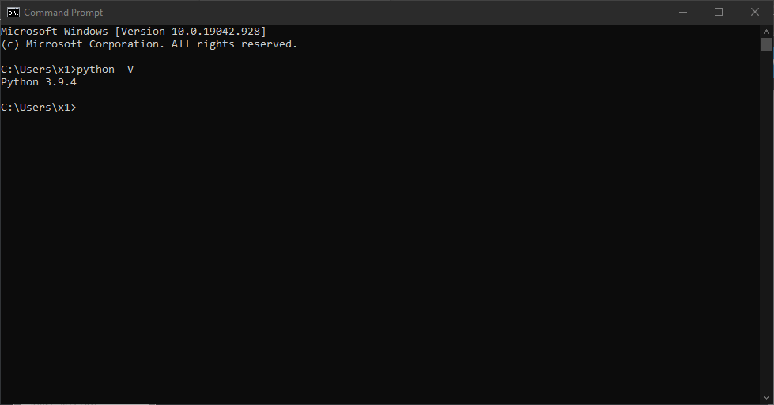

**If python is not installed in your windows, [follow this](https://codinasion.vercel.app/blog/how-to-install-python-in-windows)**

---

### Pip

[pip](https://pypi.org/project/pip/ "pip") is the package installer for Python. You can use pip to install packages from the Python Package Index and other indexes.

You can upgrade pip by running command

```bash
python -m pip install --upgrade pip
```

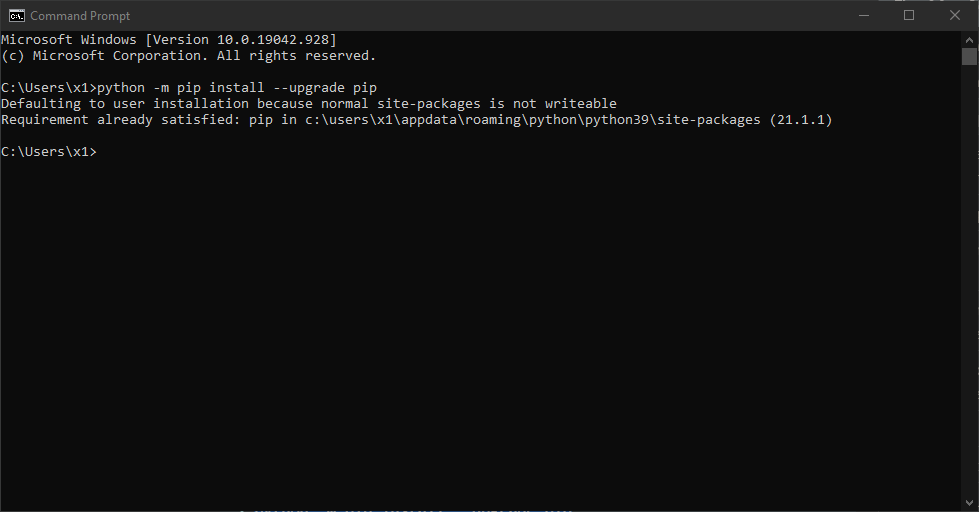

---

### Virtual Environment

[Virtualenv](https://virtualenv.pypa.io/en/latest/#:~:text=virtualenv%20is%20a%20tool%20to,library%20under%20the%20venv%20module. "virtualenv") is a tool to create isolated Python environments.

```bash
pip install virtualenv
```

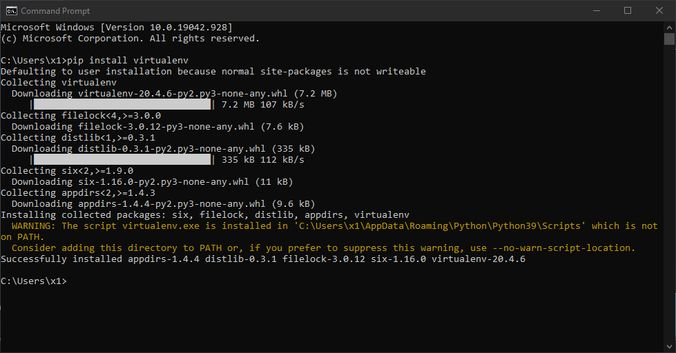

#### Virtual Environment Setup

```bash
mkdir django_setup
cd django_setup
```

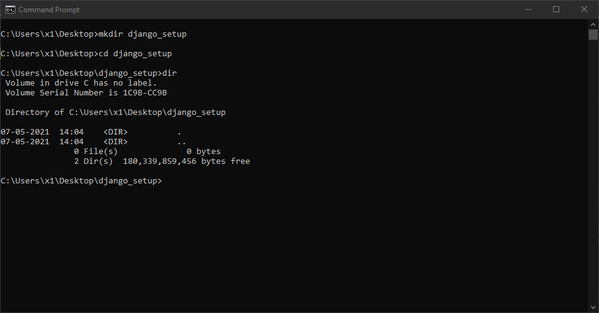

```bash
python -m venv env
```

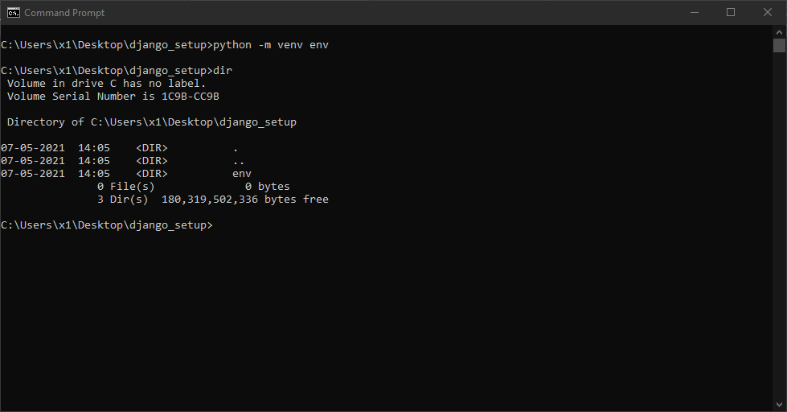

---

#### Activating virtual environment

```bash
env/Scripts/activate
```

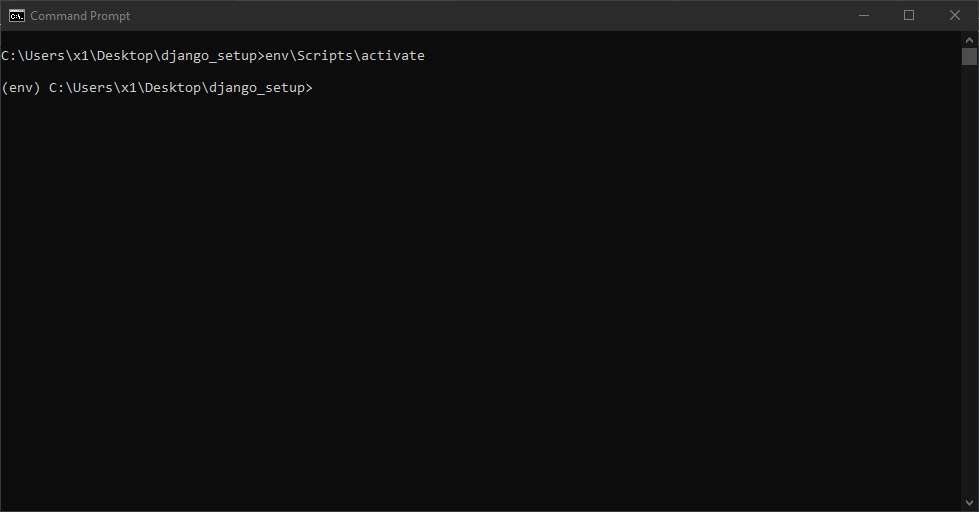

#### Deactivating virtual environment

```bash
deactivate
```

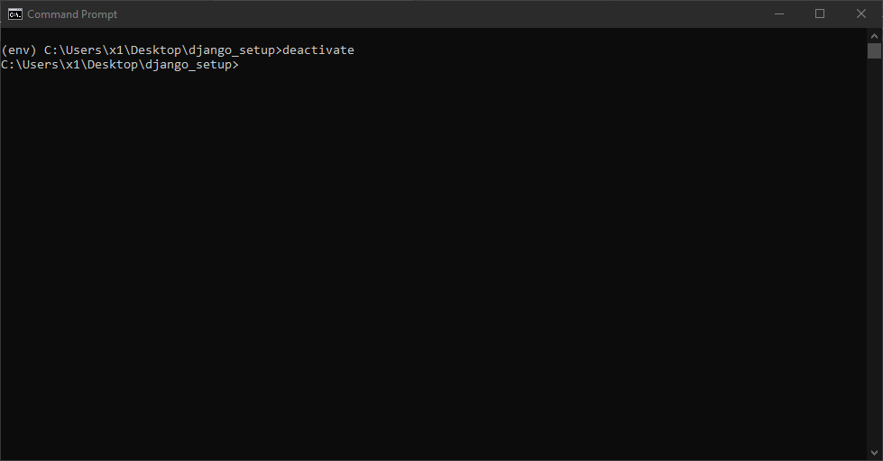

---

### Django installation

**Note :- Before procedding to installation, activate your virtual envirnment (env), otherwise Django will be installed on your system (not in virtual environment), which can cause errors for future projects**

```bash
pip install django
```

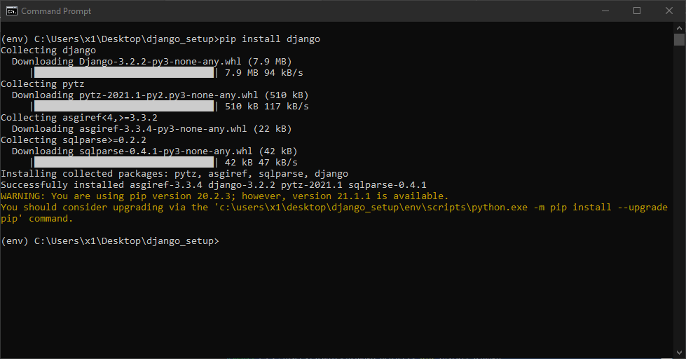

##### Verify installation

```bash
django-admin --version
```

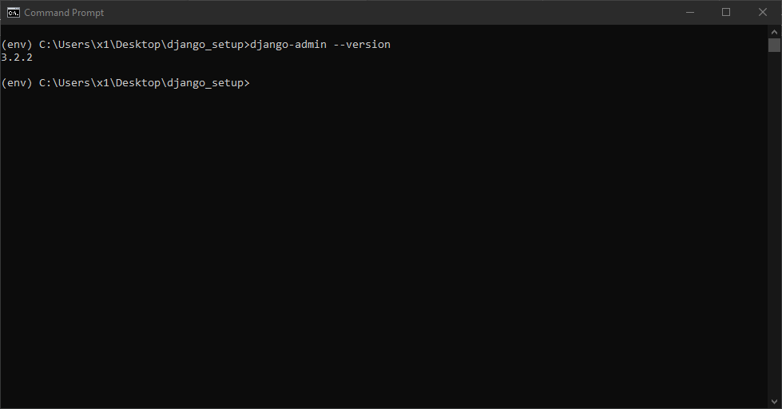

---

### Project Setup

#### Create a django project

```bash
django-admin startproject hello_world
```

```bash
cd hello_world
```

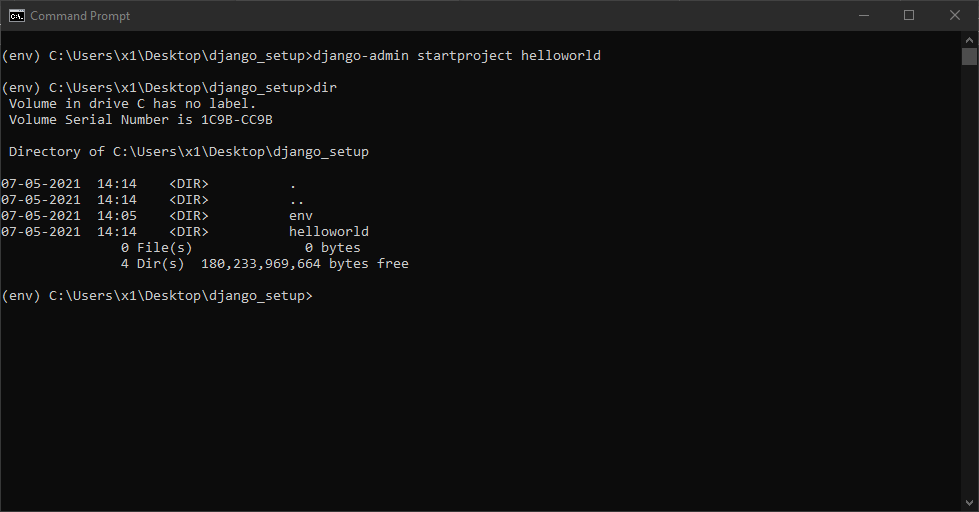

This command will create a hello_world folder (i.e. a django project) with basic django folder structure.

---

### Running localhost

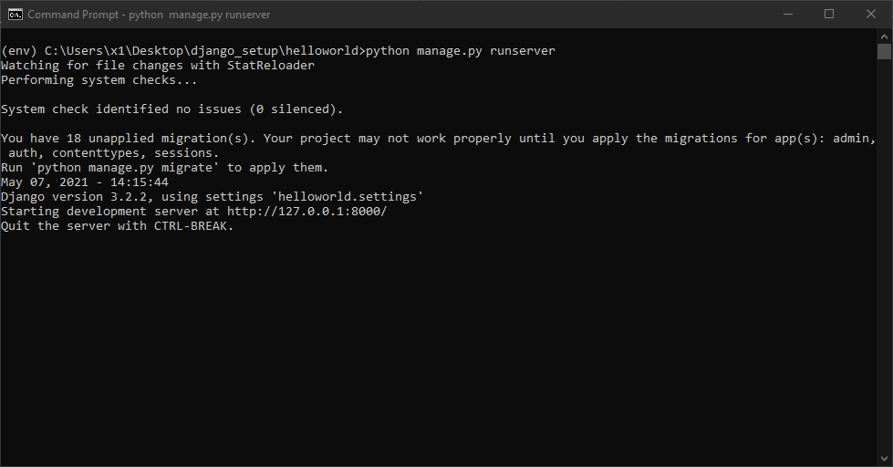

**You will see a warning about unapplied migrations for the first time runserver command. So, we have to migrate all migrations before first time runserver command.**

```bash
python manage.py migrate
```

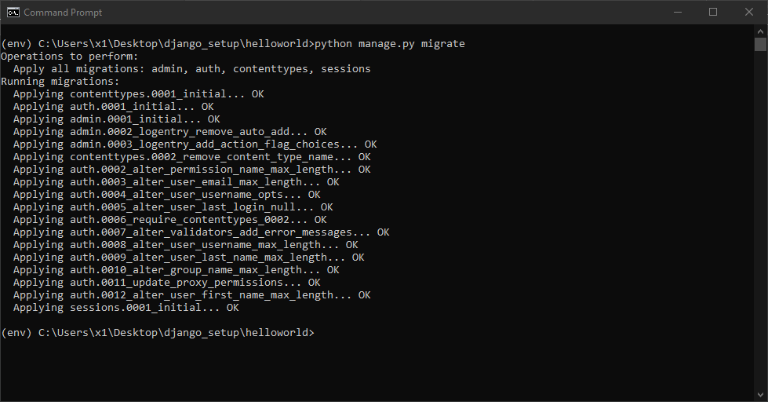

```bash
python manage.py runserver
```

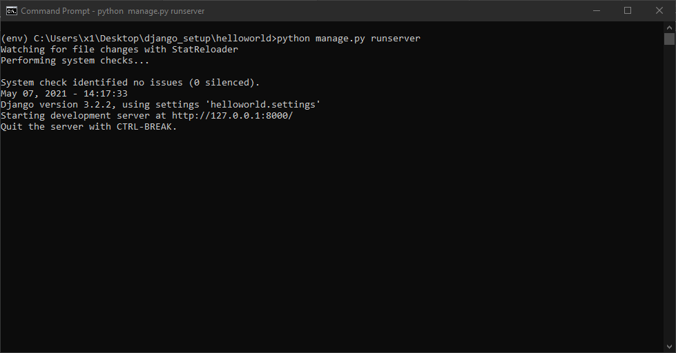

---

### First look of project

This is the default homepage provided by Django.

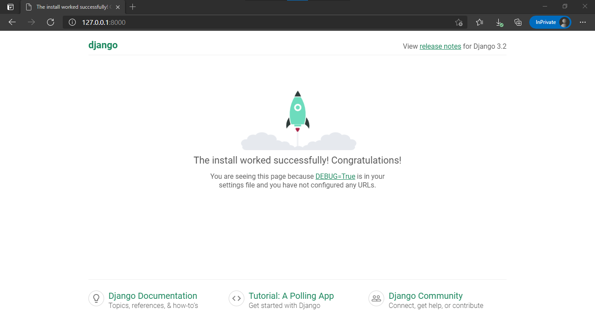

---
