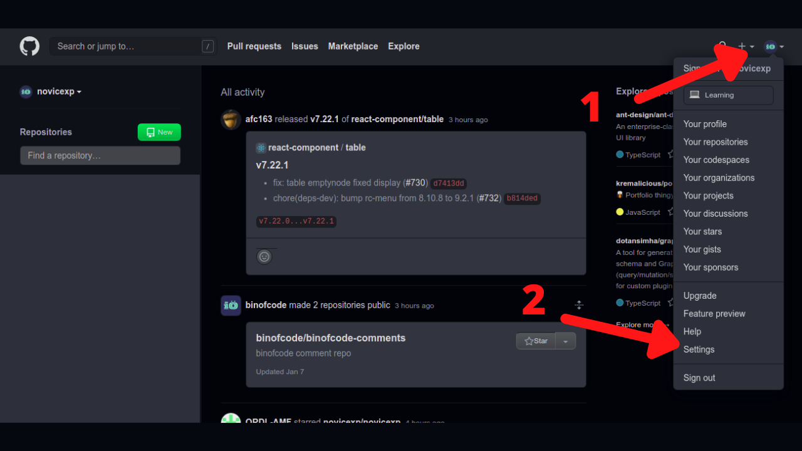
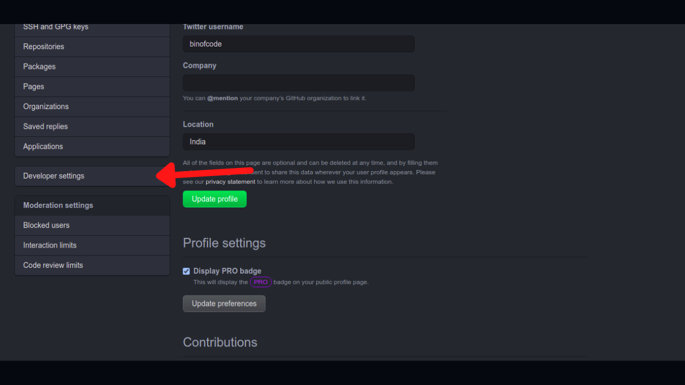
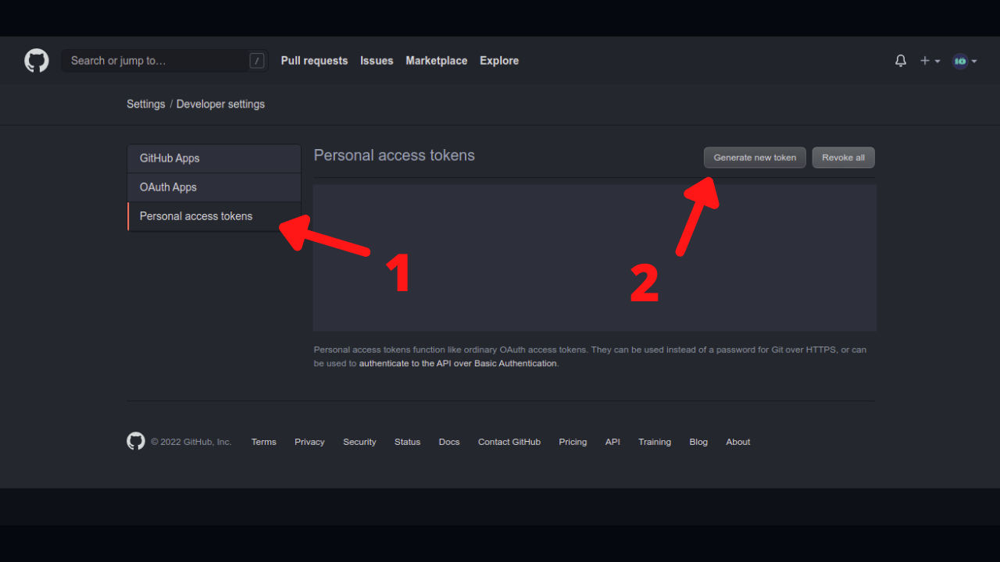
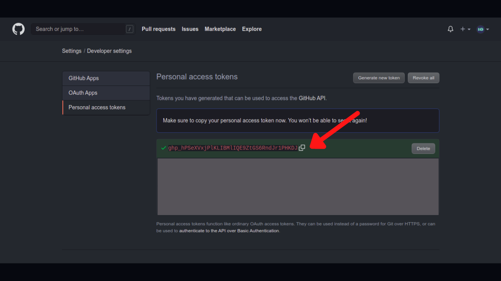

Github Personal access token (PAT) is an alternative to using passwords for authentication to GitHub when using the GitHub API or the command line.

This post will help you in setting up **github personal access token** (PAT)

## Step 1 - Goto Settings

## Step 2 - Goto Developer Settings

## Step 3 - Generate Token

- Goto **Personal Access Token**

- Click **Generate New Token**

- leave all check boxes blank

- click **generate token**

Note :- **Don't forget to copy the token and save it somewhere safe**

**Done !!!**

For more info, [see this github docs](https://docs.github.com/en/authentication/keeping-your-account-and-data-secure/creating-a-personal-access-token)

---
